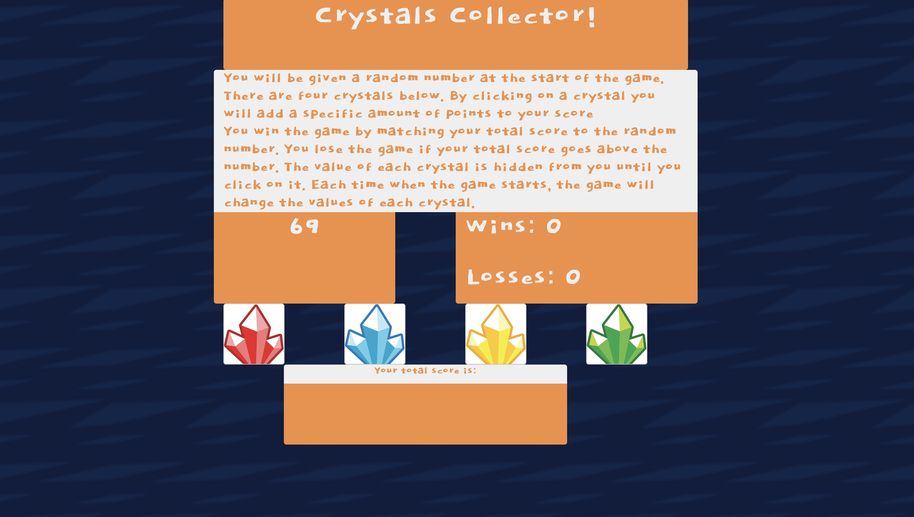

# Crystals Collector
The crystals collector game challenges the user but first selecting a random number between 19 and 101. Random values between 1 and 12 are assigned to the crystals and hidden from the user. When the user clicks a crystal, the values of the crystals are added to the user's current score. The objective of the game is to match the random computer number with the user's current score. This will result in a "win"; if the user's score goes over the computer number then the user will be given a loss.

# Deployment
The game is currently deployed on GitHub pages @ https://bee25141.github.io/crystals-collector/

# Built With
Bootstrap - The CSS framework used.
JavaScript.
CSS.
HTML.

# Authors
Tony Bee